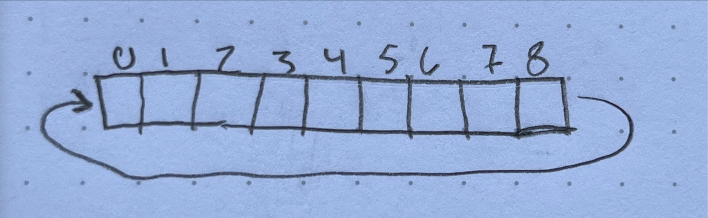
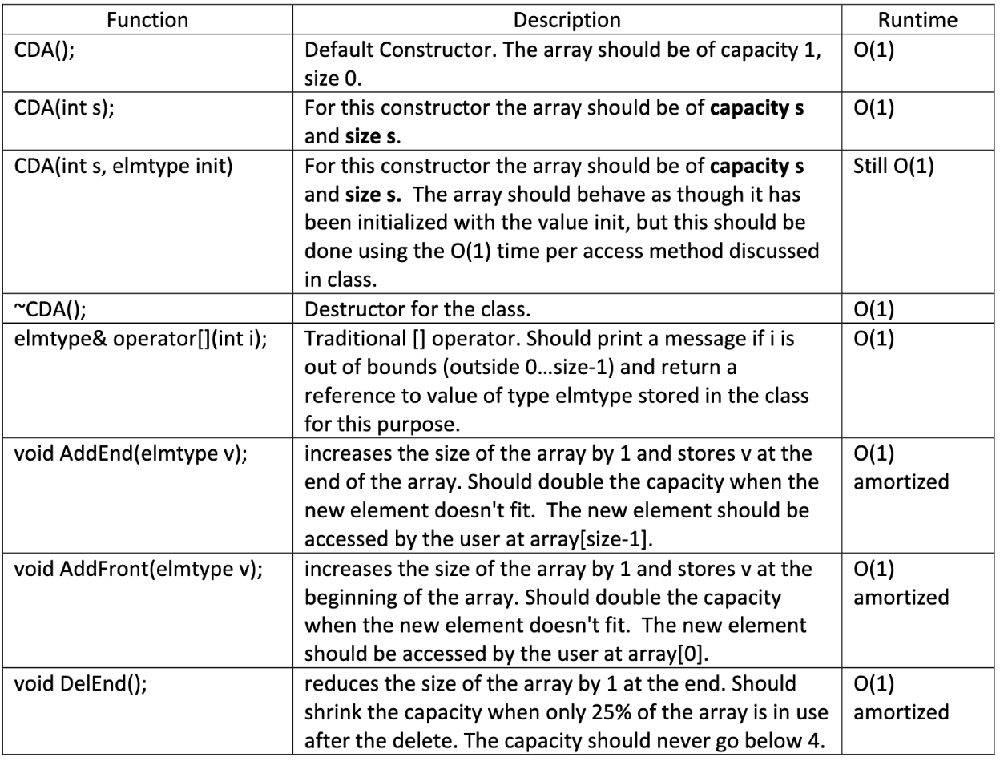
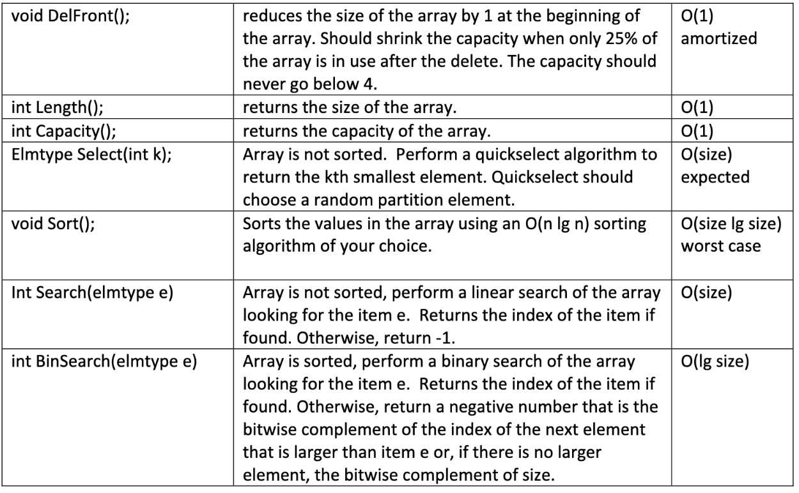
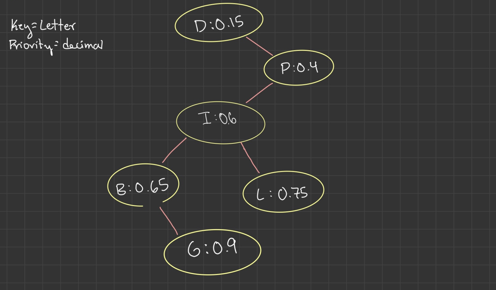
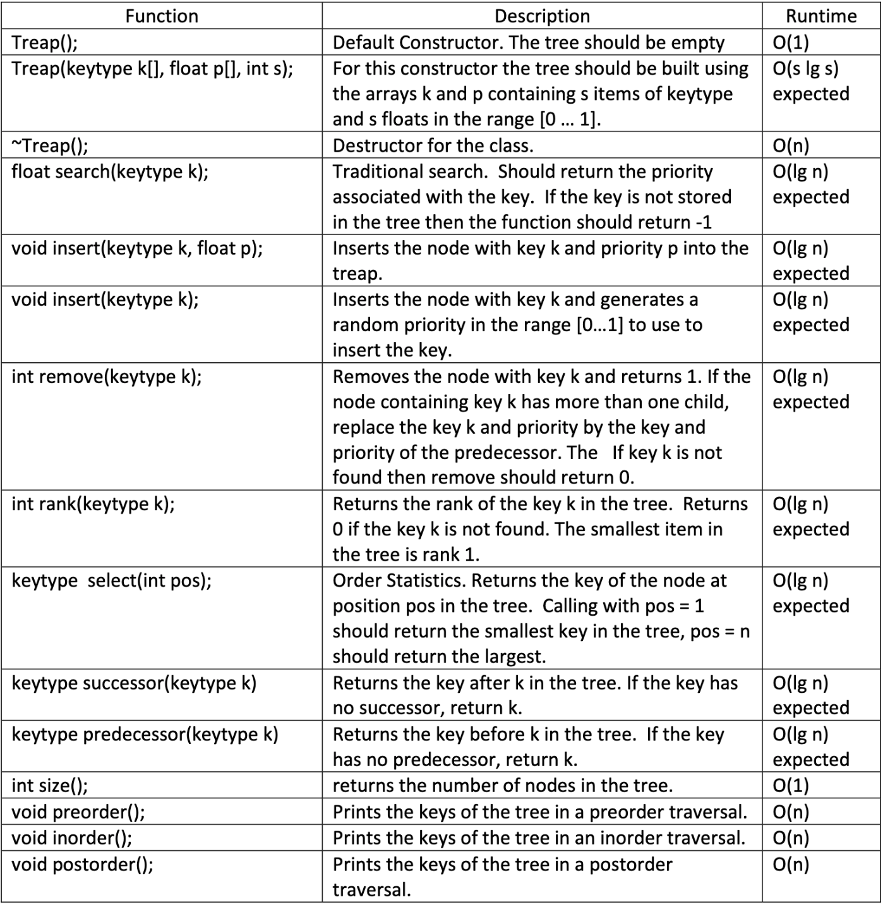
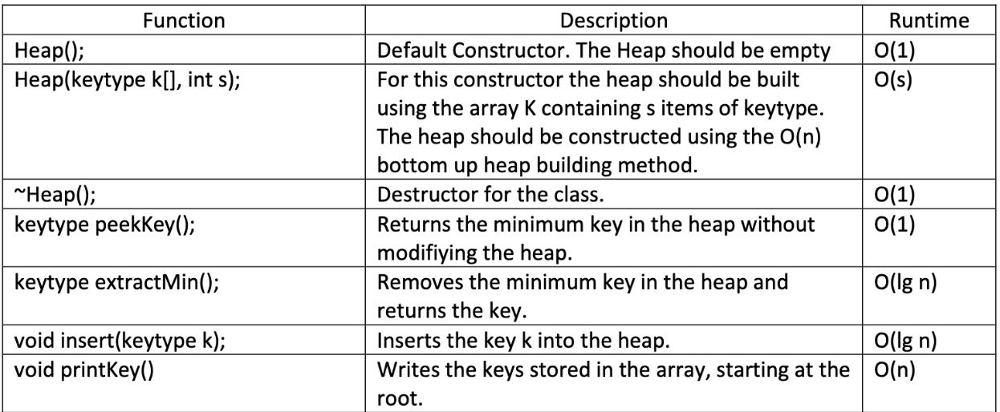

# A Growing Data Structure Library
This is my library to practice implementing data structures. These data structures do not work perfectly nor are they entirely optimized, but they have helped me learn a great deal about writing clean code, commenting my code, and planning projects to minimize debugging time. I have also learned a great deal about different libraries I can use in C++ and how to utilize documentation effectively.

## What do these data structures do?
All of these data structures are implemented as C++ classes and can work with templated data allowing for integration with multiple types of data projects. The data structures implemented in this library include:
* Circular Dynamic Array
* Treap
* Fibonacci Heap
* Heap

## The Circular Dynamic Array [C++]

Here is an image illustrating the format of the Circular Dynamic Array: 

This Circular Dynamic Array has the following attributes:
  * Capacity Doubles when adding data to a full array
  * Capacity is reduced by half when less than 25% of the capacity contains data 

The project requirments for the Circular Dynamic Array were:

## Treap | (Binary Search Tree + Heap) [C++]
Illustration of the general treap structure:

The requirements for this treap include:
  * Maintain binary search tree order:
      * smaller data points are always left children of the current node
      * larger data points are always right children of the current node
  * Maintain a heap heirarchy with values of higher priority at the top of the treap and lower priority towards the leaves of the treap 

[Here](https://github.com/oyrussell/DataStructureLibrary/blob/main/assets/images/Treaps.pdf) is a pdf with formal documentation of treaps. 

The project requirments for the treap were:

## Fibonacci Heap [C++]

The requirements for this Fibonacci Heap include:
  * Maintain a Priorioty Queue of Heap-Ordered Trees
  * Each Heap-Ordered Tree maintains the minimum-heap property
      * The Key of a child is always greater than or equal to the key of the parent node

The project requirments for the treap were:

## Heap [C++]
The requirements for this Heap include: [Work in Progress]

The project requirments for the Heap were:

